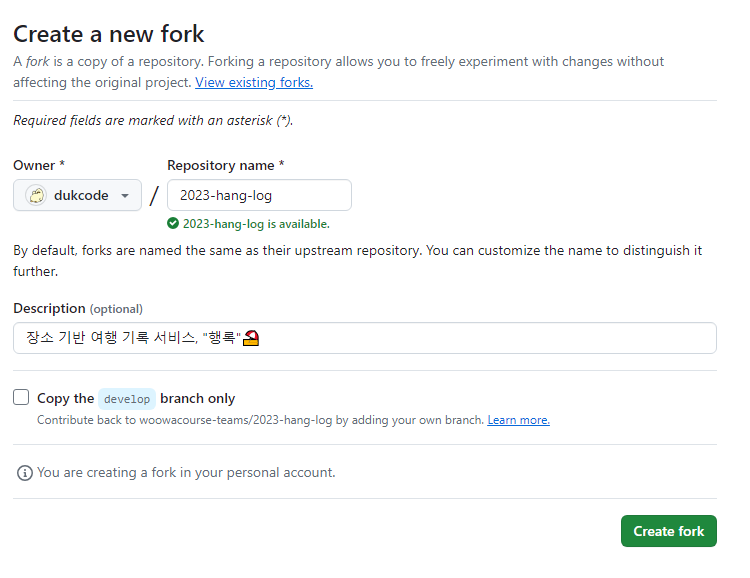
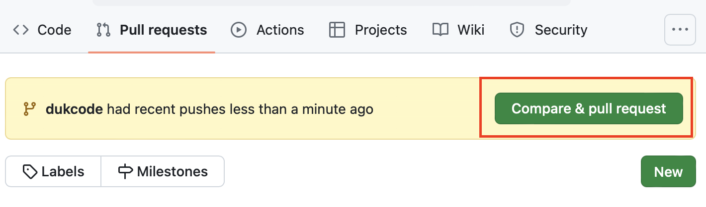
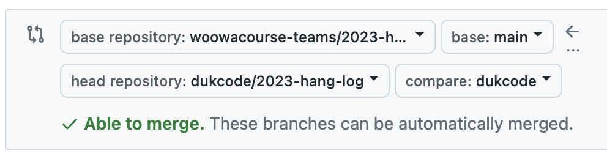

# 🎈 SSAFY 12기 구미 2반 Algorithm Study 🎈

SSAFY 12기 구미 2반 알고리즘 스터디 레포지토리 입니다.

## 🥅 goal

- 코딩 테스트를 필요로 하는 **기업에 대비**
- **알고리즘/코딩** 테스트와 친해지기
- **문제 해결**을 위한 **사고력 향상**

## ⏬ Process

- 각자 매일 최소 1문제 이상 풀어서 결과를 PR한다. (**오후 10시까지**)
  - 문제는 웹에서 확인할 수 있는 문제를 푼다.
  - 프로그래머스, 백준, SWEA, algospot, leetcode 등을 활용한다.
  - 스터디원끼리 상의해 같은 문제를 풀어도 된다.
- 스터디원들은 PR를 확인하고 이모지를 추가한다. 모든 팀원이 확인했다면 해당 PR을 머지한다. (**익일 오전 9시 머지**)
  - 추가로 리뷰하고 싶은 내용은 comment 활용한다.
- 주 1회 만나서 일주일동안 풀었던 1~2 문제 선정해서 발표 (**요일과 시간은 상의해서 추후에 결정 예정**)
  - 문제 선정은 자유

## 📖 Guide

**GitHub** 및 **git** 사용법에 대한 가이드입니다.

### 1. GitHub Repository fork


우선 GitHub에서 [SSAFY 12기 구미 2반 알고리즘 스터디 레포지토리](https://github.com/dukcode/ssafy-12th-gumi-02-algorithm-study.git)를 **fork**합니다.

**fork**란 원격 레포지토리를 내 계정의 레포지토리로 복제하는 것을 말합니다.

**fork** 버튼을 클릭하면 다음과 같은 화면을 볼 수 있습니다.



원하는 이름으로 리포지토리 이름을 변경하고 Description을 수정하세요.

**체크박스는 꼭 풀어줍니다.**(미리 만들어준 브랜치들을 함께 가져오기 위함 입니다.)

**fork**를 마치면 GitHub의 내 리포지토리 목록에서 복제된 리포지토리를 확인할 수 있습니다.

### 2. 복제된 원격 Repository clone


복제된 원격 레포지토리로 접속해 위의 버튼을 눌러 해당 원격 리포지토리의 주소를 복사합니다.

터미널에서 다음과 같이 입력해 로컬에 원격 리포지토리를 **clone**합니다.

```sh
git clone ${원격_리포지토리_주소}
```

### 3. Branch 이동

**clone**한 폴더로 접속해 각자 개인의 브랜치로 **switch**합니다.

브랜치의 이름은 **깃허브 아이디**로 합니다.

```sh
git branch -a # 브랜치 목록 확인
git switch ${개인 브랜치 이름}
```

### 4. 문제 풀이 및 커밋

프로젝트 최상단에 각자의 브랜치 이름(깃허브 아이디)으로 디렉토리를 생성합니다.

알고리즘 풀이는 각자의 디렉토리 내부에서 작업합니다.

> 주의: 🚨 항상 각자의 브랜치에서 작업해 주세요. 🚨

각자의 디렉토리 내부의 디렉토리 구조는 각자 효율적인 방법으로 만듭니다. 예시는 다음과 같습니다.

```text
project-root
├── dukcode
│   ├── swea
│   │   ├── s1013.py
│   │   ├── s92121.py
│   │   └── ...
│   ├── baekjoon
│   │   ├── b2093.py
│   │   ├── b8121.py
│   │   └── ...
│   └── programmers
│       ├── p5113.py
│       ├── p5792.py
│       └── ...
│   
└── 타인_디렉토리_1
└── 타인_디렉토리_2
└── ...
```

각자 알고리즘 문제를 풀고 다음 명령어로 **commit**합니다.

```sh
git add .
git commit -m "dukcode: 백준 8121 풀이"
```

커밋 메세지는 아래와 같은 형식으로 작성합니다.

```text
[깃허브 아이디]: [알고리즘 플랫폼 이름] [문제 번호] 풀이
```

- 깃허브 아이디 뒤에 스페이스를 띄우지 않습니다.
- 콜론(`:`) 뒤에 스페이스를 한 칸 띄웁니다.
- 알고리즘 플랫폼 이름엔 백준, 프로그래머스, swea 등의 플랫폼 이름을 명시합니다.
- 문제 번호엔 문제를 식별할 수 있는 이름이나 번호를 명시합니다.

한 문제당 하나의 커밋을 작성 합니다. 여러 문제를 풀었다면 여러 번 커밋합니다.

### 7. Push

문제를 풀었다면 푼 문제 수 만큼의 커밋이 쌓였을 것입니다. 이것을 본인의 리모트 리포지토리에 **push**합니다.

```sh
git push -u origin ${브랜치 이름} # 처음 push할 때
git push # 이후 push할 때 (자동으로 origin으로 push 됩니다.)
```

### 6. Pull Request 작성

이제 포크한 깃허브 리포지토리의 `Pull Request` 탭에 접속합니다.



`Compare & Pull Request` 버튼을 눌러 PR을 생성합니다.



🚨 **base repository**를 `dukcode/ssafy-12th-gumi-02-algorithm-study`로 꼭 변경해줍니다. 🚨

PR 템플릿에 따라 내용을 작성합니다.

🚨 PR올리는 시간은 오후 10시까지입니다. 코드 리뷰를 하기 위해서 시간을 꼭 지켜주세요.🚨

### 7. 코드 리뷰

다른 사람이 올린 문제풀이를 확인하고 코드를 리뷰합니다.

- 궁금하거나 리뷰하고 싶은 부분이 있는 경우: 코멘트로 소통합니다.
- 리뷰하고 싶은 부분이 없는 경우: 👍 이모지를 추가합니다.

### 8. Merge

모든 스터디원이 리뷰를 했다면 익일 오전 9시에 해당 PR을 머지합니다.
